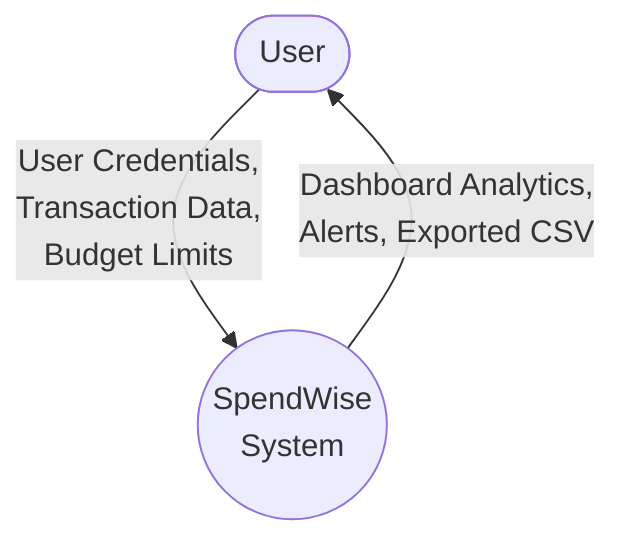
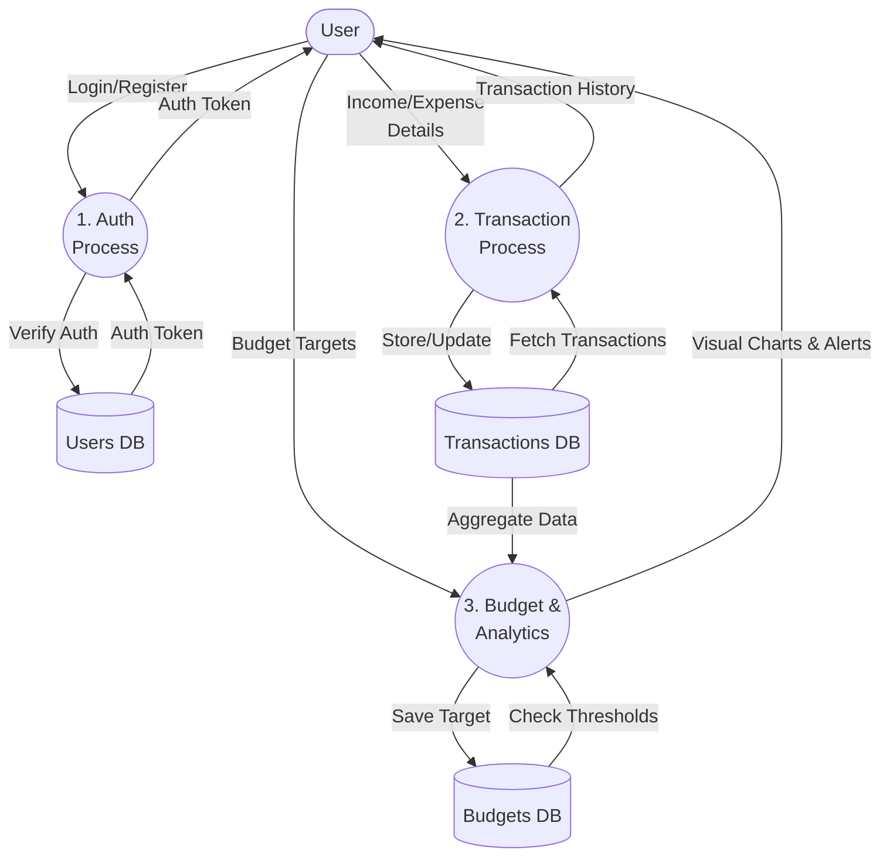
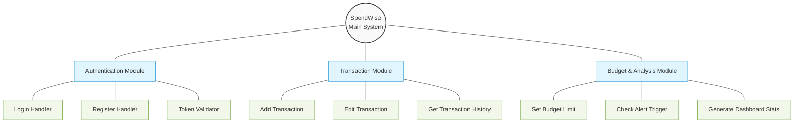

# 1. Functional Oriented Diagrams

This document contains the functional models for the SpendWise application, illustrating system data flows, modular hierarchy, and data definitions.

## 1.1 Data Flow Diagram (DFD) - Level 0 (Context Diagram)
The Context Diagram represents the entire SpendWise software system as a single process, showing its interactions with principal external entities (The User).

## 1.2 Data Flow Diagram (DFD) - Level 1
Level 1 breaks down the Context Diagram into the major sub-processes: Authentication, Transaction Processing, and Budget & Analytics.

## 1.3 Data Dictionary
A structured definition of the vital data elements traveling through the DFDs.

| Data Element | Description | Composition/Attributes |
| :--- | :--- | :--- |
| **UserCredentials** | Data required to authenticate a user. | `email` (String), `password` (String) |
| **UserProfile** | Data stored for an authenticated user. | `_id` (ObjectId), `name` (String), `email` (String), `hashed_password` (String) |
| **TransactionData** | Details of a financial log (income/expense). | `_id` (ObjectId), `user_id` (ObjectId), `amount` (Float), `type` (String: Income/Expense), `category` (String), `date` (DateTime), `description` (String) |
| **BudgetData** | Financial thresholds set by the user for a category. | `_id` (ObjectId), `user_id` (ObjectId), `category` (String), `limit_amount` (Float), `spent_amount` (Float), `month` (Integer), `year` (Integer) |
| **DashboardData** | Aggregated data returned to the user view. | `total_income` (Float), `total_expense` (Float), `net_balance` (Float), `pie_chart_data` (List), `line_chart_data` (List) |

## 1.4 Structured Chart
The Structured Chart focuses on the modular breakdown and control hierarchy of the application.

