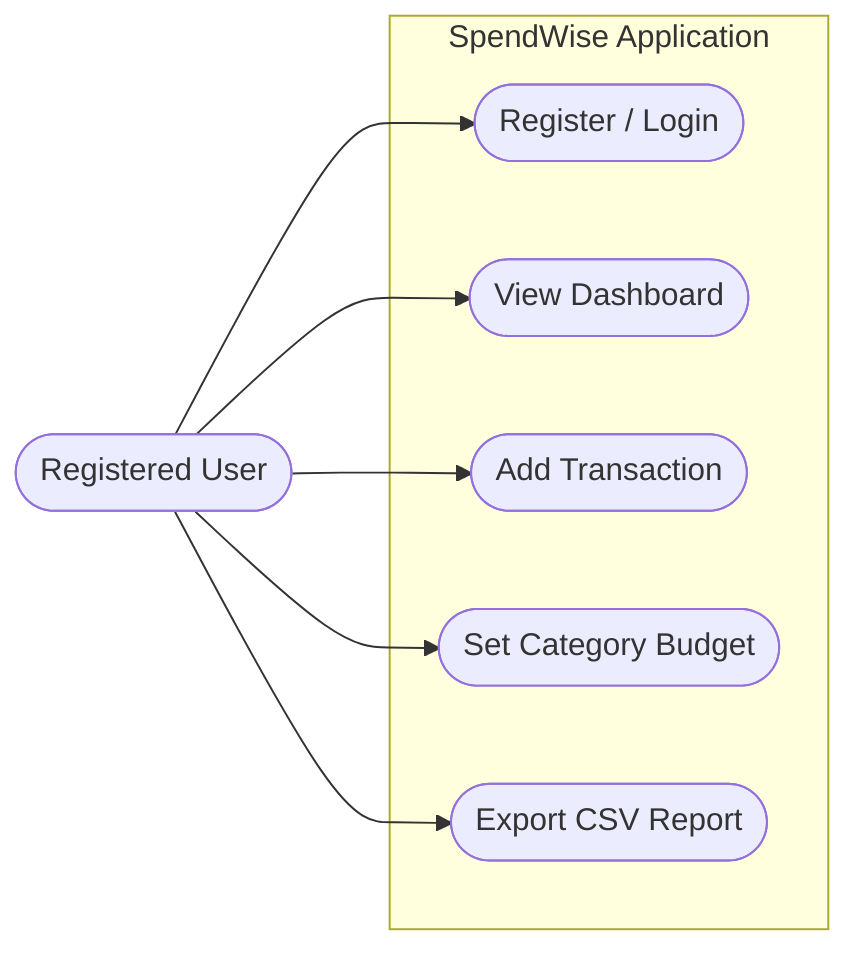

# 2. User View Analysis

This document describes the application from the end-user's perspective to outline exactly what functions are available to them.

## 2.1 Use Case Diagram
The Use Case Diagram defines the capabilities of the primary actor interacting with the system boundary.

```mermaid
usecaseDiagram
  actor User as "Registered User"
  
  rectangle SpendWise Application {
    usecase UC1 as "Register / Login"
    usecase UC2 as "View Dashboard"
    usecase UC3 as "Add Transaction"
    usecase UC4 as "Set Category Budget"
    usecase UC5 as "Export CSV Report"
    usecase UC6 as "Toggle Dark Theme"
  }
  
  User --> UC1
  User --> UC2
  User --> UC3
  User --> UC4
  User --> UC5
  User --> UC6
  
  UC3 .> UC2 : <<includes>> Update Stats
  UC4 .> UC2 : <<includes>> Track Alert Limit
```
*(Note for Markdown Renderers: Standard Mermaid does largely support Use Case diagrams via graph/flowchart logic if generic usecase diagrams fail, but the above syntax represents the standard format. A fallback representation utilizing flowcharts is provided below for immediate visualization if the renderer lacks specific `usecase` support.)*

**Fallback Visual Representation (Flowchart):**


## 2.2 Use Case Scenarios

Detailed analysis of the most critical use cases.

### Scenario 1: Add a Transaction (UC3)
| Field | Description |
| :--- | :--- |
| **Actor** | Registered User |
| **Pre-condition** | The user has successfully logged into the application. |
| **Main Flow** | 1. User navigates to the Transactions page.<br>2. User clicks "New Transaction".<br>3. User enters Amount, selects Type (Income/Expense), selects a Category, and adds an optional description. <br>4. User clicks "Save".<br>5. System validates the input.<br>6. System saves transaction to DB and returns Success. |
| **Alternative Flow**| If amount is invalid or negative, system triggers an alert banner and halts submission. |
| **Post-condition**| The user's dashboard balance, charts, and budget progress bars are immediately updated. |

### Scenario 2: Set a Category Budget (UC4)
| Field | Description |
| :--- | :--- |
| **Actor** | Registered User |
| **Pre-condition** | The user is authenticated. |
| **Main Flow** | 1. User navigates to the Budgets page.<br>2. User selects a predefined Category (e.g., Food & Dining).<br>3. User inputs a monetary limit and hits "Save Budget".<br>4. System stores limit in the Budgets collection.<br>5. System scans current month's expenses against the new limit. |
| **Alternative Flow**| If the limit is improperly formatted, system halts. |
| **Post-condition**| A budget progress bar appears. If current spending hits 80%, a warning alert is triggered on the dashboard. |

### Scenario 3: Export CSV Report (UC5)
| Field | Description |
| :--- | :--- |
| **Actor** | Registered User |
| **Pre-condition** | The user has logged at least one transaction. |
| **Main Flow** | 1. User navigates to the Transactions page.<br>2. User clicks the "Export CSV" button.<br>3. The System compiles all active user transactions into CSV format.<br>4. Application initiates a file download to the user's host machine. |
| **Alternative Flow**| If the user has 0 transactions, export returns an empty CSV with only headers. |
| **Post-condition**| The user receives a local `transactions.csv` file without mutating any database states. |
