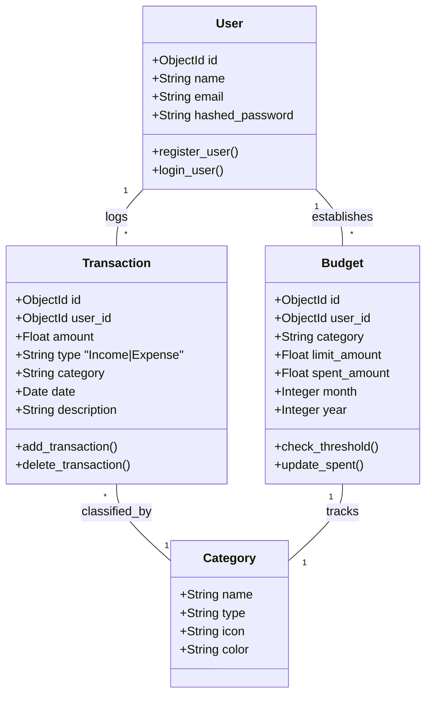
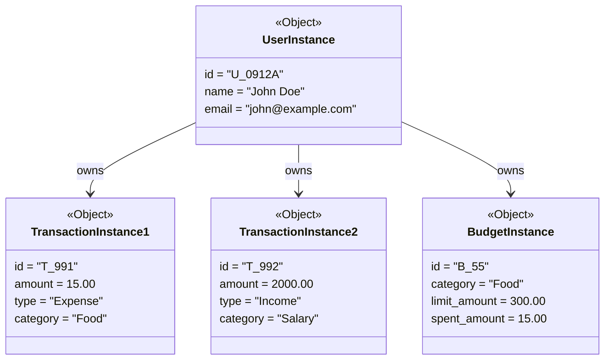
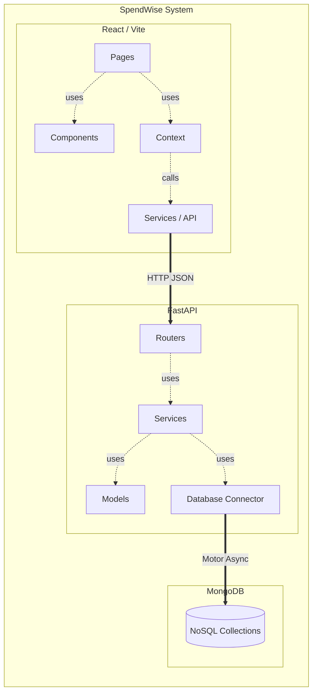

# 3. Structural View Diagrams

This document illustrates the static architectures and static relationships defined within the SpendWise application.

## 3.1 Class Diagram
The Class Diagram isolates the Backend Models (Pydantic objects) and exactly how they associate with each other in memory and the DB.

## 3.2 Object Diagram
This diagram reveals a runtime snapshot showing instantiated instances of the classes above representing a single user session state.

## 3.3 Package Diagram
The Package diagram defines the file-directory level architecture dividing logically coupled components in the repository.

