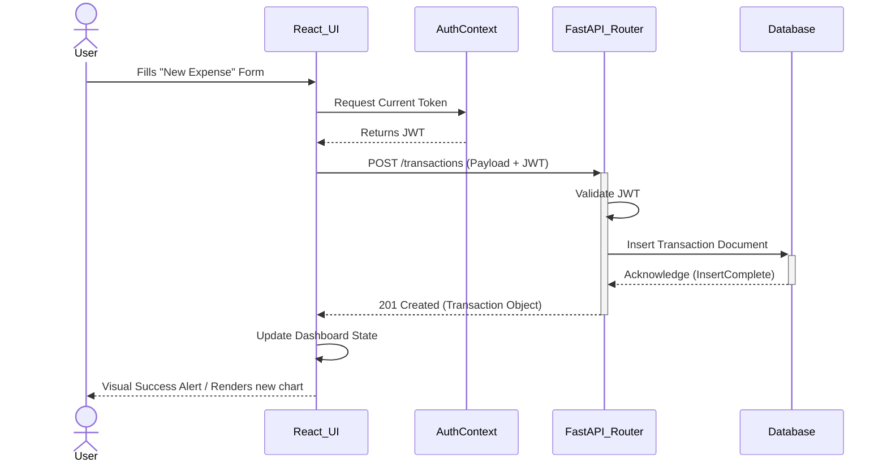
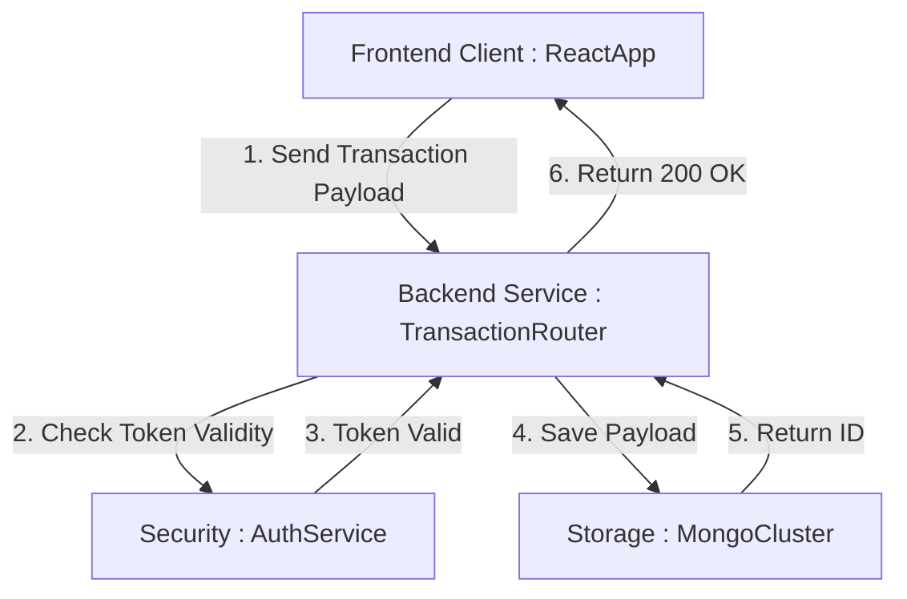
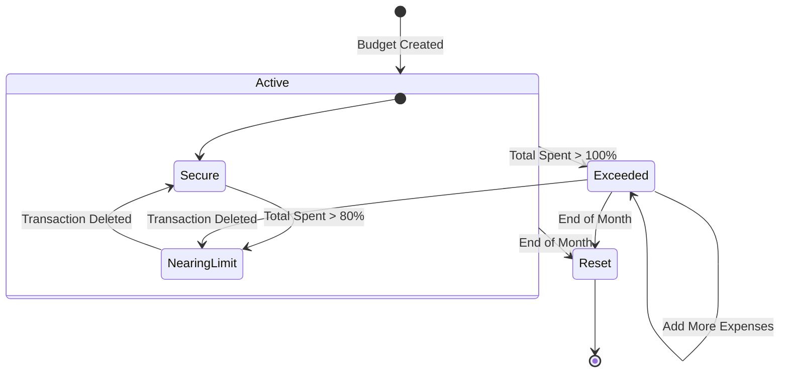
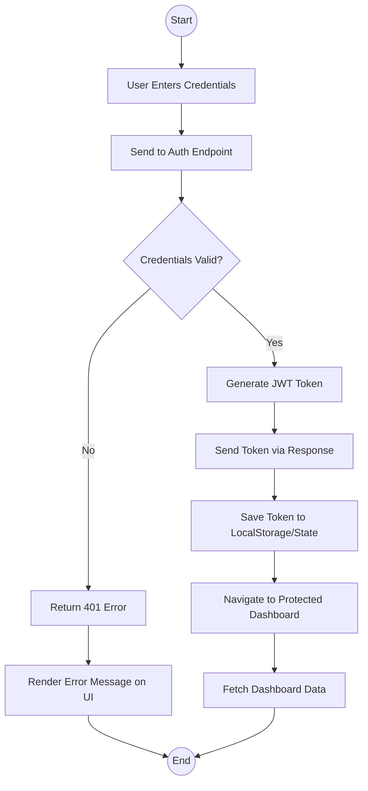

# 4. Behavioral View Diagrams

This document highlights the dynamic behavior of the SpendWise system—showing how messages are passed chronologically, how statuses shift, and the logical flow of actions.

## 4.1 Sequence Diagram
Maps out the exact chronological series of requests and responses when a user logs a new expense.

## 4.2 Collaboration Diagram (Communication Diagram)
Displays object interactions arranged around the objects and their links to each other rather than a strict chronological timeline.

## 4.3 State-chart Diagram
Maps the complete lifecycle of a `Budget` entity within a user's account over a single month.

## 4.4 Activity Diagram
Shows the procedural workflow a user goes through when attempting to access secure data.

