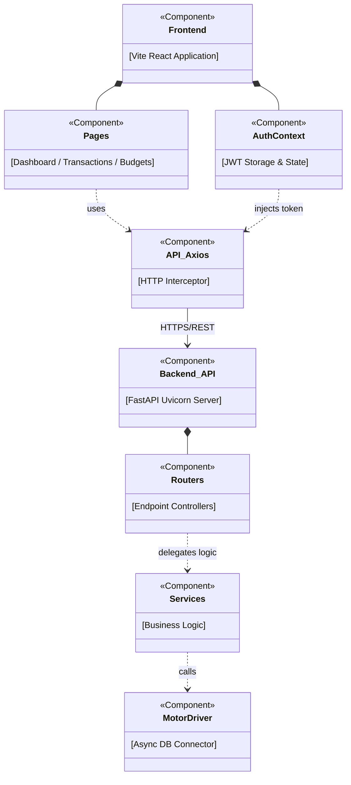
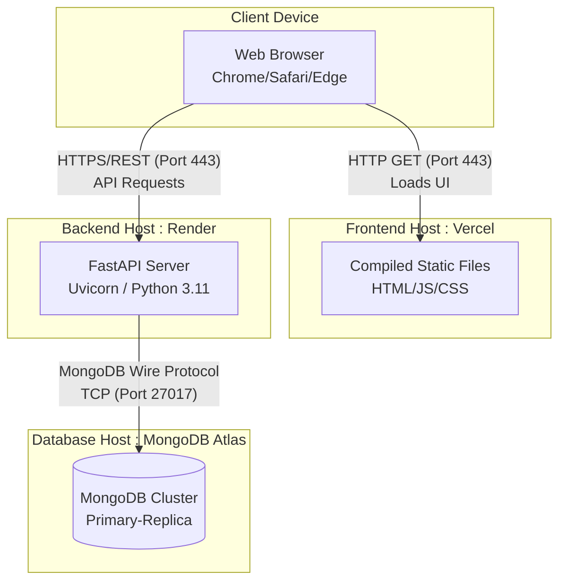

# 5. Implementation and Environment View Diagrams

This document illustrates the physical architecture of the application, including the source-code component wiring and the physical hardware/network deployment nodes.

## 5.1 Component Diagram
The Component Diagram details how the various modular parts of the software are wired together, specifically separating frontend UI modules from backend API modules.

## 5.2 Deployment Diagram
The Deployment Diagram represents the physical deployment layout, mapping software components to the hardware / cloud network environments they execute on.

